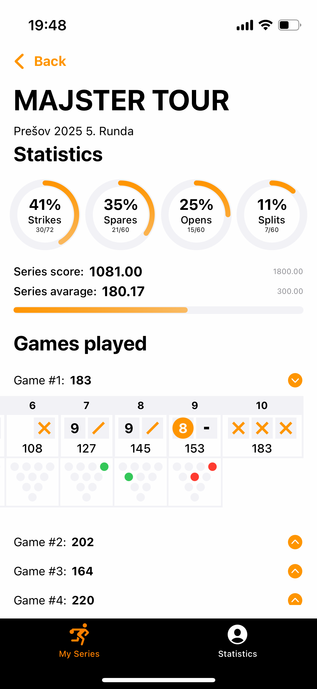
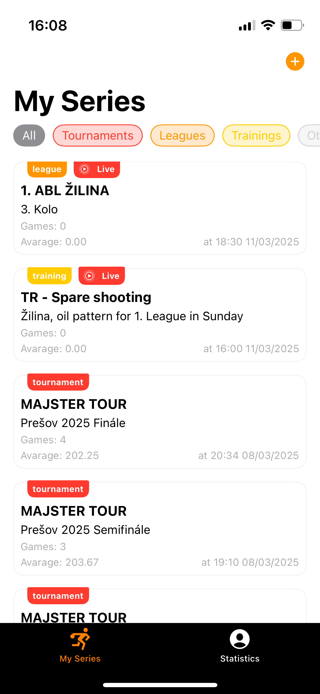
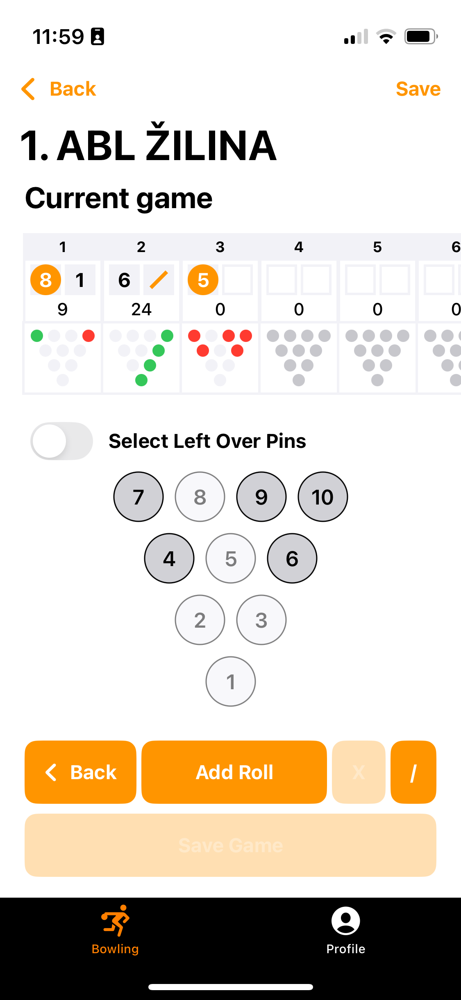

# Bowling Tracker

Bowling Tracker is a mobile application for tracking bowling games and statistics.

<div style="display: flex; justify-content: center; gap: 10px;">
    
    
    
</div>

## Features
- Create and manage bowling series
- Record individual game scores pin by pin
- Calculate statistics such as average score, strike percentage, and spare percentage
- Save data to Firebase
- Resume an ongoing game
- **Pin selection mode** – manually select standing or left over pins before rolling  

## Technologies Used
- **SwiftUI** – modern UI framework for iOS apps
- **Combine** – reactive programming framework
- **Firebase** – data storage and authentication
- **MVVM** – architectural pattern for clean and maintainable code

## Installation
1. Clone the repository:
   ```
   sh git clone https://github.com/hajducak/BowlingTracker.git
   ```
2. Use `main` only 
3. Open the project in Xcode.
4. Ensure all dependencies are installed (e.g., Firebase via Swift Package Manager).
5. Run the app on a simulator or a physical device.

## Contribution

If you want to contribute to the project, fork the repository, create a new branch, make changes, and submit a pull request.
License

This project is available under the MIT license.

## Future Features
- **Offline game saving** – store games locally when offline and sync with the cloud once reconnected  
- **Comprehensive statistics** – detailed insights, including pinfall percentages  
- **Frame editing** – edit the current game frame in case of a misclick  
- **Pinfall visualization** – view pinfall results for each individual frame  
